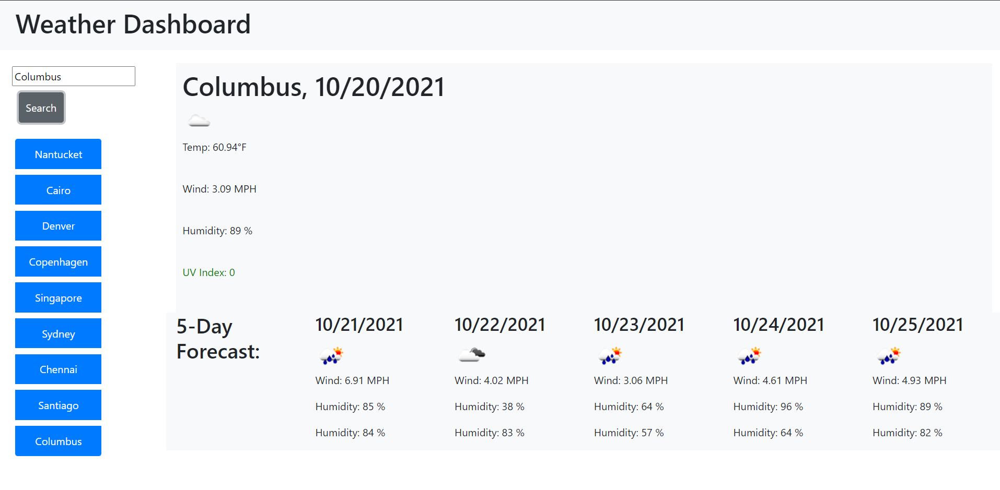

# HW-06: Weather Dashboard

## About This Project

This project was an excercise in using an online API to retrieve and display data. 

The website is a Weather Dashbaord that utilizes openweathermap.org API. The user's inputted location is fed into the Open Weather Map API and returns the current weather and a 5-day forecast of that location. The first API fetch call utilizes the user's inputted city name and returns the longitutde and lattitude of the city, as well as current weather data. This initial API call did not return sufficient information, such as the UV Index or daily forecast. Therefore, a second API call using the longitutde and lattitude is used to return the complete weather data to be utilized. Finally, the appropriate values inside the object returned from the API were assigned to the proper elements to be displayed to the user. 

The layout of this website utlized Bootstrap's row and column grid system. The dates for the current weather and 5-day forecast were created using moment.js's today() function and formatting. 
## User Story

```
AS A traveler
I WANT to see the weather outlook for multiple cities
SO THAT I can plan a trip accordingly
```

## Acceptance Criteria

```
GIVEN a weather dashboard with form inputs
WHEN I search for a city
THEN I am presented with current and future conditions for that city and that city is added to the search history
WHEN I view current weather conditions for that city
THEN I am presented with the city name, the date, an icon representation of weather conditions, the temperature, the humidity, the wind speed, and the UV index
WHEN I view the UV index
THEN I am presented with a color that indicates whether the conditions are favorable, moderate, or severe
WHEN I view future weather conditions for that city
THEN I am presented with a 5-day forecast that displays the date, an icon representation of weather conditions, the temperature, the wind speed, and the humidity
WHEN I click on a city in the search history
THEN I am again presented with current and future conditions for that city
```

## How To Use




To use the Weather Dashboard first input your city's name into the search bar on the lefthand side. The website will then call on the Open Weather Map API to return the lattitude and longitude of the inputted city, which will then be used for a second API to return the current weather and 5-day forecast. This information is displayed on the webpage, with current weather in a larger central box and the 5-day forecast below it. Recent searches are saved below the search bar, and those buttons can be pushed to return the weather of that city. The recently searched cities are stored to local storage and persist upon the page being refreshed. 

## Access

The Weather Dashboard can be accessed at https://tjtahmas.github.io/Locational-Weather-Dashboard/

The GitHub repository for this project is available at https://github.com/tjtahmas/Locational-Weather-Dashboard
## License

This project was created as part of The Ohio State University Coding Boot Camp


